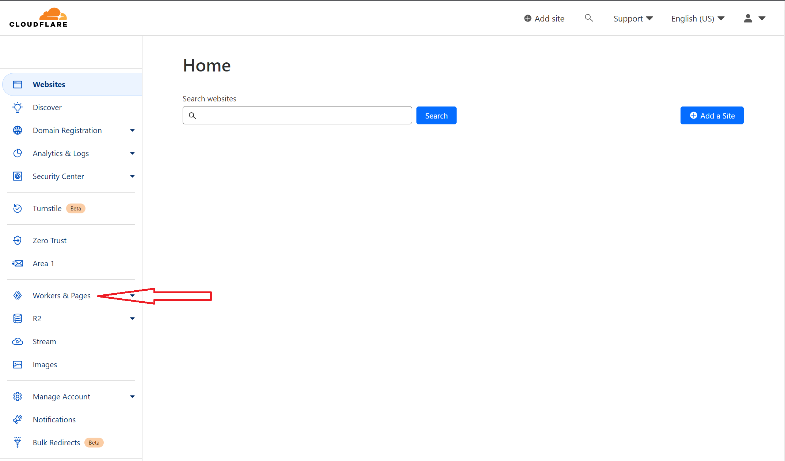
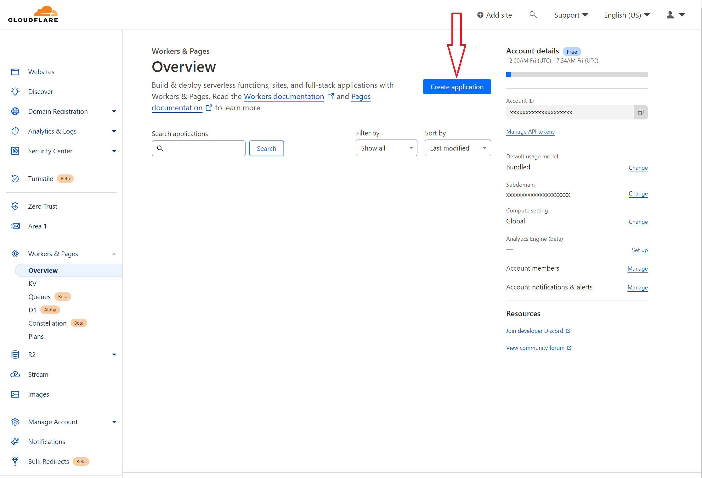
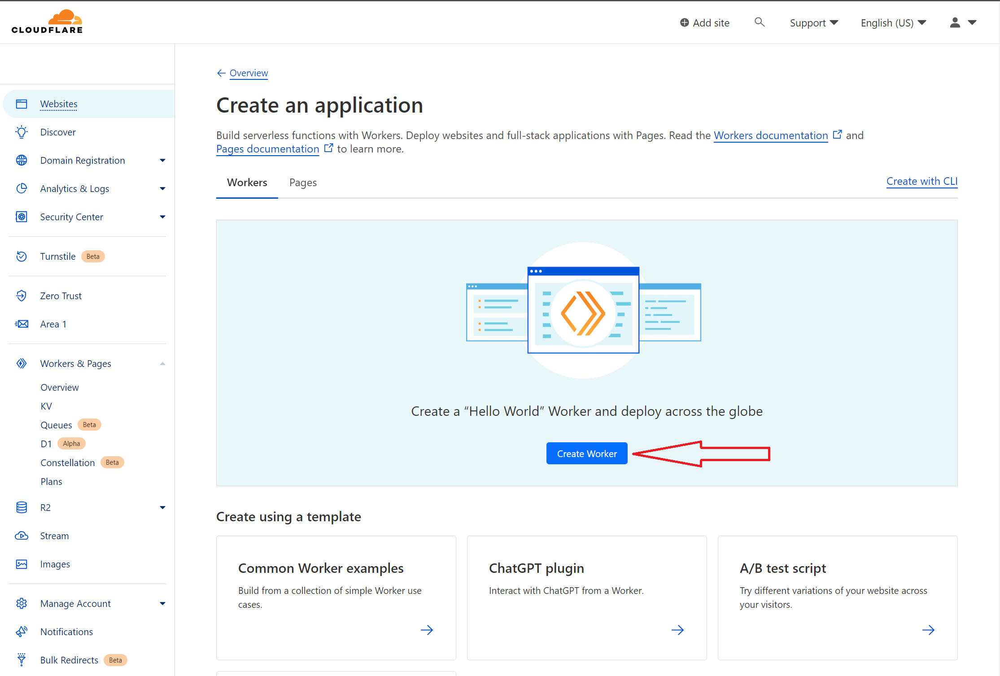
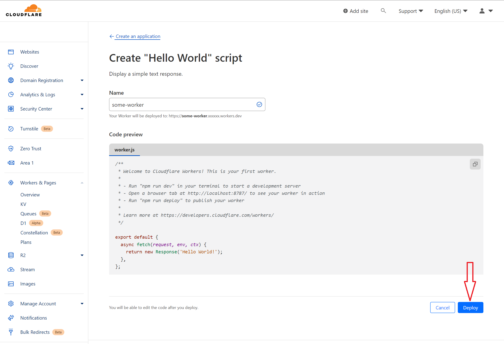
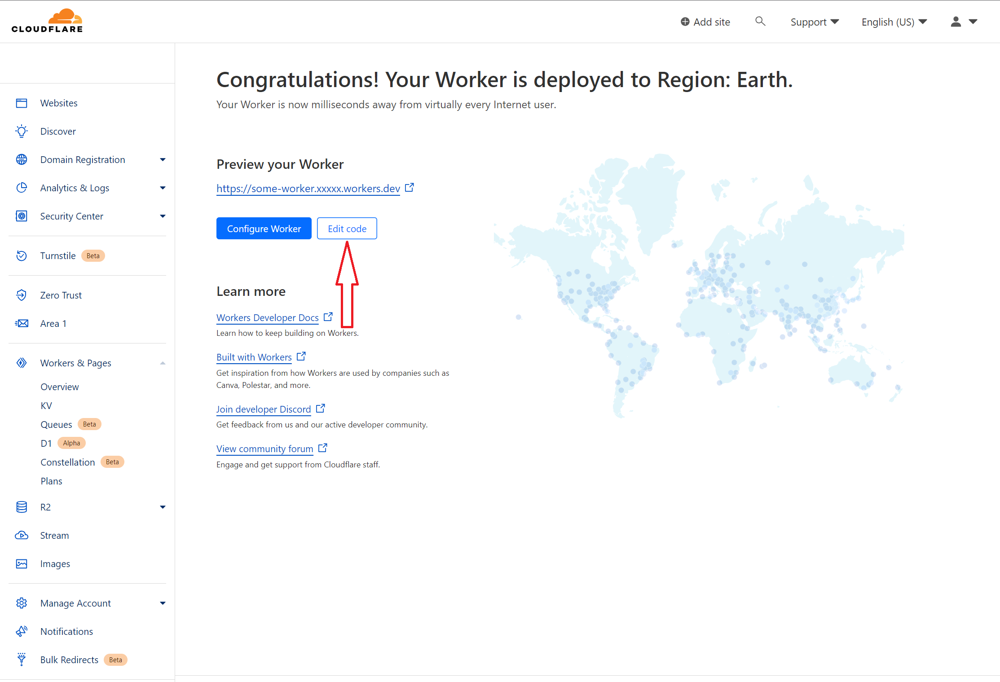
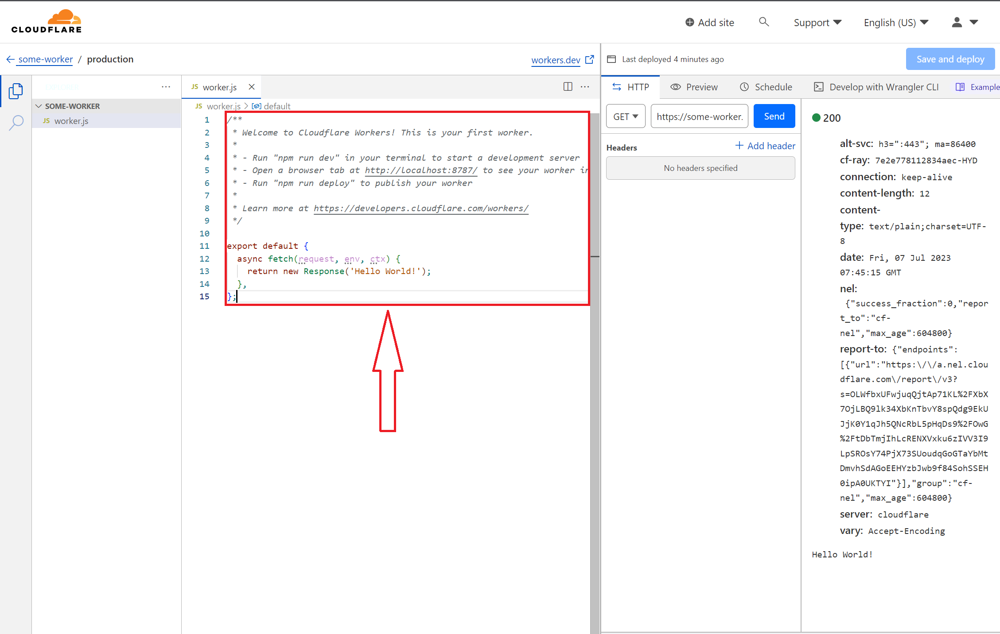
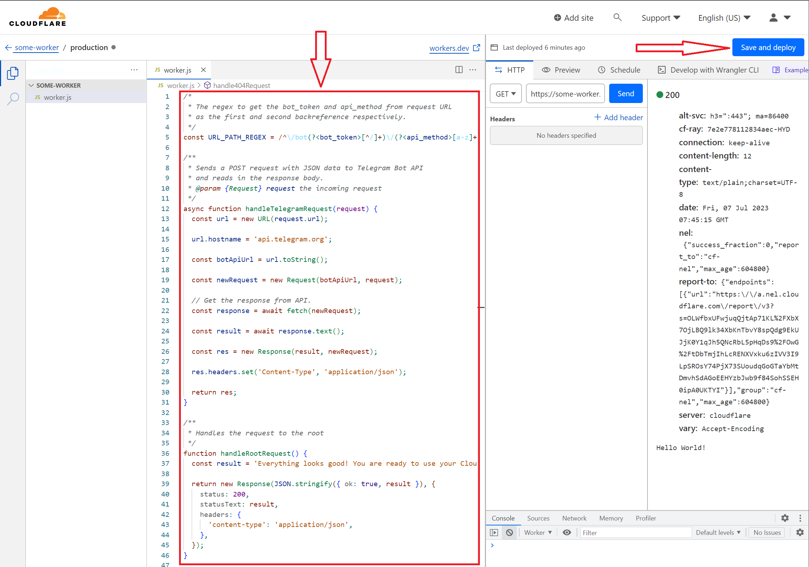
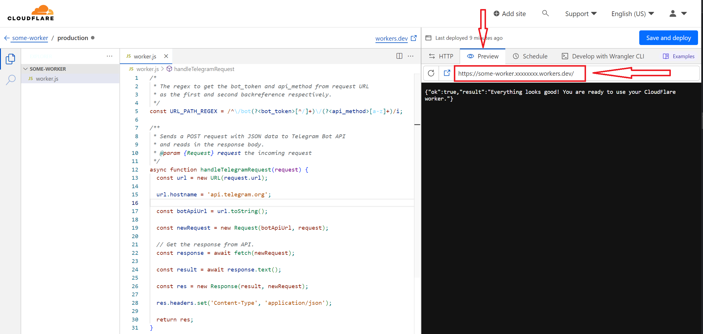

# How to Deploy

-   Goto [CloudFlare Dashboard](https://dash.cloudflare.com) and sign up/in. If you are new to CloudFlare, it may ask you to add a domain. If you don't want to add a domain, just open the above link again.

-   On the Dashboard goto "Workers & Pages" and verify your email if needed.

    

-   You will be asked to create a Workers subdomain. Enter the subdomain you want.
-   Click on "Create application" or Edit if you have already created one.

    

-   Click on "Create Worker" to proceed.

    

-   Click on "Deploy".

    

-   Click on "Edit code".

    

-   Erase all the code given in the code editor.

    

-   Copy the code from [index.js](https://github.com/manzoorwanijk/telegram-bot-api-worker/raw/master/index.js) and paste into the code editor.

-   Ensure that you have pasted the code correctly and click on "Save and deploy" and confirm the deployment.

    

-   Click on "Preview" tab to see the final worker URL.

    

-   Copy the final URL and use it wherever you want.
